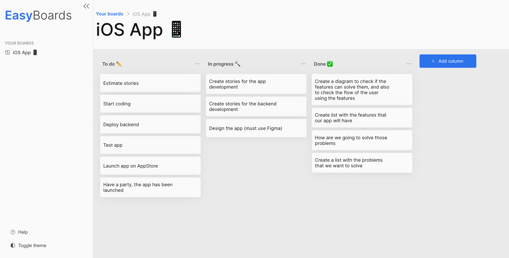

<div align='center'>
  
 </div>

<p align="center">
  
  
  <!-- <a href='https://github.com/TiagoDiass' target='_blank'>
    
  </a> -->
</p>

<h4 align="center">
  A front-end app similar to Trello developed by <a href='https://github.com/TiagoDiass' target='_blank'>@TiagoDiass</a> where people can manage their tasks
</h4>

<p align="center">
  <a href="#final-result">Final result</a>&nbsp;&nbsp;&nbsp;|&nbsp;&nbsp;&nbsp;
  <a href="#technologies">Used technologies</a>&nbsp;&nbsp;&nbsp;|&nbsp;&nbsp;&nbsp;
  <a href="#features">Features</a>&nbsp;&nbsp;&nbsp;|&nbsp;&nbsp;&nbsp;
  <a href="#tests">Tests</a>&nbsp;&nbsp;&nbsp;|&nbsp;&nbsp;&nbsp;
  <a href="#deploy">Deploy</a>&nbsp;&nbsp;&nbsp;|&nbsp;&nbsp;&nbsp;
  <a href="#how-to-run">How to run</a>
</p>

<div align='center'>
  
 </div>
 
 <h2 align="center">
  <a href="https://easy-boards.vercel.app/" target="_blank">
    
  </a>
</h2>

<h2 id="final-result" name="final-result">
  ✅ Final result
</h2>

### [Click here to check the application running on Vercel](https://easy-boards.vercel.app/)

<h2 id="techonologies" name="technologies">
  🖥 Used Technologies
</h2>

- [Next.js](https://nextjs.org/)- Next.js is a framework built on top of React.
- [TypeScript](https://www.typescriptlang.org/) - Typescript is a superset of the common JavaScript. With that, we can type and maintain our code easier.
- [Styled Components](https://styled-components.com/) - Styled components is a CSS-in-JS library.
- [React Testing Library](https://testing-library.com/) - React Testing Library is a library that allows us to create unit and integration tests of React components.
- [Storybook](https://storybook.js.org/) - Storybook is an open source tool for building UI components and pages in isolation. It streamlines UI development, testing, and documentation.
- [ESLint](https://eslint.org/) and [Prettier](https://prettier.io/) - With ESLint and Prettier, we can improve our code quality by linting and auto formating it.

<h2 id="features" name="features">
  :clipboard: Features
</h2>

- [x] User can drag and drop tasks into columns
- [x] User can reorder the columns by dragging and dropping them
- [x] User can create tasks
- [x] User can delete tasks
- [x] User can create columns
- [x] User can delete columns
- [x] User can edit a column name
- [x] The board data is persisted into the browser's localStorage so the user will not loose his/her board data
- [x] The application starts with a simple first board so the user can start using the app without having to create his/her own board. A starter board also helps users to get to know the app when they are having their first contact with that
- [x] User can change the application's theme from light to dark mode (and the theme is persisted into the browser's localStorage so the application will keep the selected theme)
- [x] User can create multiple boards:
  - [x] User can create a board starting from a starter template (basic Kanban template)
  - [x] User can create a board starting with no template (that is, the board will start empty instead of with the basic Kanban columns)
- [x] User can change a board name
- [x] User can delete a board
- [ ] Custom 404 page to tell user that he/she tried to access a board that doesn't exist
- [ ] Multilanguage (English and Portuguese)
- [ ] User can change a board background
- [ ] User can sign in in order to save his/her boards data into a database, this way the user will be able to acess his/her boards from any browser in any computer, not only the browser that has the localStorage data set
  - [ ] Sign in with Google
  - [ ] Sign in with Github
- [ ] User can change his/her profile data (name, title, picture)

#### Do you have an idea of feature? Get in touch with me and we can talk about a contribution to the project!

<h2 id="tests" name="tests">
  🧪 Tests
</h2>

<h3 align="center">Almost 100% of code coverage in tests ✅</h3>
<p align="center">
  
</p>

<div align="center">
  
</div>

<h2 id="deploy" name="deploy">
  :rocket: Deploy
</h2>

I have deployed this application on [Vercel](https://vercel.com/). It's configured with a continuous deployment with this Github repository, that is, everytime the codebase from the `main` branch of this repository gets updated, Vercel will trigger a build of the project and will put it in production.
[Click here to check the application running on Vercel](https://easy-boards.vercel.app/)

### 📚 Storybook

Storybook is a live documentation of the application components. It helps developers that are getting to know the codebase, designers that want to validate the components implemented by the developers, developer that want to know how to use any component of the app and so on. I have deployed the Storybook of this app on Vercel with a continuous deployment just like the application itself.

### [Click here to check the application's storybook running on Vercel](https://easyboards-storybook.vercel.app/)

<div align="center">
  
</div>

<h2 id="how-to-run" name="how-to-run">
  :arrow_forward: How to run
</h2>

### First steps

If you want to run the application in your computer, follow these steps;
First of all, you'll need to clone the repository and install the dependencies. Assuming you have [Yarn](https://yarnpkg.com/) installed in your computer, follow the steps bellow:

```
# Clone the repo
$ git clone https://github.com/TiagoDiass/easyboards.git

# Enter the repo's folder
$ cd easyboards

# Install the dependencies
$ yarn install
```

### Application
To run the application, just follow the steps below (assuming you have followed the first steps above)
```
# Start the app
$ yarn dev
```

After following these steps, the terminal will show you in which port it's running, it's on the port 3000 usually, so, you'll just need to enter in your browser and
type `localhost:3000`, then you'll be able to check the app running. When you want to stop it, go to the terminal that you used to start the app, and type <kbd>CTRL</kbd>+<kbd>C</kbd>,
this way you'll stop the app

### Tests
To run the application tests, follow the steps below (assuming you have followed the first steps above)
```
# Run the tests
$ yarn test

# If you want to run the tests in order to see the code coverage, run:
$ yarn test:coverage
```
### Storybook
Storybook is a live documentation of all components that were developed to use in this app. To start the Storybook, just follow the steps below (assuming you have followed the first steps above)
```
# Start the Storybook app
$ yarn storybook
```
After starting the Storybook, the terminal will show you in which port it's running, it's on the port 6006 usually, so, you'll just need to enter in your browser and
type `localhost:6006`, then you'll be able to check the storybook app running. When you want to stop it, go to the terminal that you used to start the app, and type <kbd>CTRL</kbd>+<kbd>C</kbd>,
this way you'll stop the app

---

## :wave: [Get in touch!](https://www.linkedin.com/in/tiagodiass)
